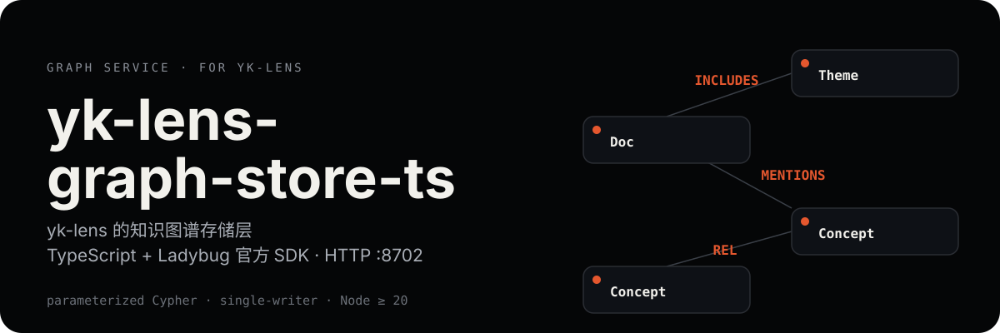

<p align="center">
  
</p>

<p align="center">
  
  
</p>

**yk-lens 的知识图谱存储层**——用 TypeScript + Ladybug 官方 SDK(`@ladybugdb/core` ^0.19.1)实现,以 HTTP 服务(`:8702`)向 lensd 提供 Doc 规则图 / Concept / Theme 的图读写。

> 只有 **lensd** 能调用;前端 / Agent 禁止直连。本进程是图库文件的唯一打开者(单写者)。

## 图模型

Ladybug 图库中的三张节点表和六种关系:

| 节点 | 关系 | 语义 |
|------|------|------|
| `Doc` | `LINKS` | 文档间规则链接 |
| `Doc` | `MENTIONS` | 文档提及 Concept |
| `Concept` | `REL` | 概念间关系 |
| `Concept` | `MENTIONS` | 概念被文档提及 |
| `Theme` | `INCLUDES` | 主题聚合文档 |
| `Doc` | `HAS_PARENT` / `CHILD_OF` | 文档层级(旧库迁移保留) |

## 为什么这么设计

- **官方 SDK,零迁移**——`@ladybugdb/core` 是 Ladybug 官方 Node-API 原生模块,可直接打开已有数据目录,无需转换。
- **参数化 Cypher**——全部走 `prepare/execute` 参数化查询,不拼接 Cypher 字符串。
- **单写者 + 串行队列**——本进程独占图库文件;单连接非线程安全,所有操作经 promise 串行队列串行化。
- **幂等 DDL + 旧库迁移**——启动自动建表 / 迁移,可安全重入。

## 快速开始

```bash
npm install

cp configs/yk-graph-ts.example.yaml configs/yk-graph-ts.yaml
# 编辑 db_path(默认 ./data/ladybug,可直接指到现网数据目录)

npm run dev          # 或 ./scripts/dev.sh start
curl -s localhost:8702/v1/health
```

lensd 切换:`export LENS_GRAPH=http://localhost:8702`(dev.sh 已默认)。

## HTTP 契约

每个端点的请求 / 响应 / 错误示例见 [docs/http-api.md](./docs/http-api.md)。

| 方法 | 路径 | 说明 |
|------|------|------|
| `GET` | `/v1/health` | 可达性 |
| `GET` | `/v1/status` | 后端状态(backend/reachable/docs) |
| `POST` | `/v1/graph/docs/upsert` | 全量替换 doc 图关系(tags + 规则边) |
| `DELETE` | `/v1/graph/docs/:id` | 删除 doc 及其全部关系 |
| `POST` | `/v1/graph/docs/remove-with-stats` | 带统计删除 → `{existed, edges}` |
| `GET` | `/v1/graph/docs/:id/related?depth=` | depth 1~2 关联文档 |
| `GET` | `/v1/graph/docs/:id/concepts` | 该 doc 的 MENTIONS 邻居 |
| `GET` | `/v1/graph/doc-edges` | 全部 doc→doc 规则边 |
| `GET` | `/v1/graph/doc-tags` | 全部 Doc 节点 tags |
| `POST` | `/v1/graph/concepts/upsert` | upsert concept |
| `GET` | `/v1/graph/concepts/:id` | 取 concept(404 = 不存在) |
| `GET` | `/v1/graph/concepts` | 全部 concepts |
| `POST` | `/v1/graph/concepts/mentions` | 只替换该 doc 的 llm mentions(human 保留) |
| `DELETE` | `/v1/graph/concepts/mentions/llm` | 失效该 doc 的 llm MENTIONS(body: `doc_id`) |
| `POST` | `/v1/graph/concepts/relations` | 幂等替换 concept REL 边 |
| `GET` | `/v1/graph/relations` | 全部 concept REL 边 |
| `POST` | `/v1/graph/themes/upsert` | upsert theme |
| `POST` | `/v1/graph/themes/membership` | 替换 theme 的 doc 成员 |
| `POST` | `/v1/admin/clear` | 清库(DROP 全表重建) |

```bash
curl -s -X POST localhost:8702/v1/graph/docs/upsert -H 'Content-Type: application/json' -d '{
  "doc_id": "01HQEXAMPLE",
  "project": "inbox",
  "path": "inbox/notes/foo.md",
  "title": "foo",
  "tags": ["rrf"],
  "links": [{"target_id": "01HQSECOND", "rel": "link"}]
}'

curl -s "localhost:8702/v1/graph/docs/01HQEXAMPLE/related?depth=1"
```

## 目录

```text
src/
  index.ts              # 入口
  config.ts             # YAML + env
  types.ts              # DTO(请求 / 响应结构)
  api/server.ts         # Express HTTP
  store/graphStore.ts   # Ladybug 官方 SDK(DDL + 18 组方法)
configs/
scripts/dev.sh
docs/http-api.md       # HTTP API 详细用法
assets/readme/          # README 视觉资产
```

## 测试

```bash
npm test          # vitest:DDL 幂等 + 每方法 round-trip + 旧库迁移 + clear(临时数据目录)
npm run typecheck
```

## 现状

- **阶段**:yk-lens 桌面阶段现行服务;是 lensd 图访问的唯一入口,前端 / Agent 一律不直连。
- **版本**:1.0.0(Node ≥ 20)。
- **启动**:仓库根 `./dev.sh start|status|stop` 一键起停(或本仓 `./scripts/dev.sh start`)。
- **端口**:`:8702`,与 yk-lens 其它服务并列——lensd `:8700` · coverto `:8701` · yk-vector-ts `:8703`。
- **数据**:图库目录默认 `./data/ladybug`(可用 `LENS_GRAPH_DATA` 覆盖);本进程独占图库文件,禁止第二个进程打开同一目录。

## 已知注意点

- `@ladybugdb/core` SDK 较年轻(2025-10 Kuzu 归档后 fork);升级需谨慎(重跑冒烟)。
- 构造 `Database` 需显式 `maxDBSize`(默认 8TB mmap 在受限环境失败,见 `graphStore.ts` 注释)。
- 参数名避免与 Cypher 保留字冲突(如 `DESC`);`description` 用 `$descr`。

## License

[MIT](./LICENSE)
